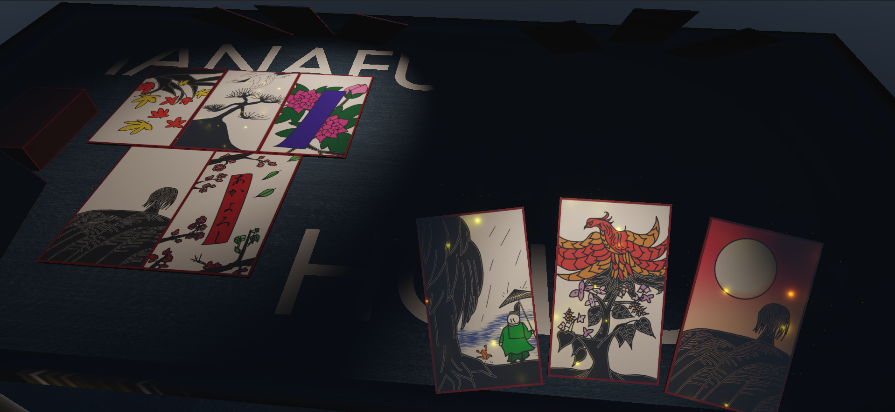

# 花札ポーカー

## 概要
オンライン対戦対応の3D花札ポーカーゲームです。

## ゲーム画面


## 開発環境
- Unity Universal 6000.0.44f1
- Visual Studio 2022
- Git / GitHub

## 使用技術
- C#
- Unity
- TextMesh Pro
- Photon Fusion
- Blender
- Krita
- MuseScore4

## セットアップ

1. このリポジトリをClone
2. Unity Hubからプロジェクトを開く
3. Package Managerから必要なPackageを導入
4. Photon Fusionの設定を行う（必要に応じて）
5. TitleSceneから起動

## ブランチ運用

master
- 安定版

develop
- Ryoncy用の開発ブランチ
  - 主にゲームシステム・ネットワークを開発

ho6ho6
- ho6ho6用の開発ブランチ
  - 主にUI・アニメーションを開発

## コーディングルール
- namespaceは `HanafudaPoker.xxx`
- クラス名・メソッド名は PascalCase
- privateメンバは SerializeField を優先する

```text
using System.Collections;

using namespace;

namespace HanafudaPoker.xxx
{
    class mono : Monobehaviour
    {
        public objectName;

        void FunctionName()
        {

        }
    }
}

```

## 現在の実装状況

- ✅ タイトル画面
- ✅ ロビーUI
- ✅ カード管理
- ✅ 役判定
- 🚧 アニメーション
- 🚧 ネットワーク

## 今後の予定
- ネットワーク同期
- SE・BGM
- エフェクト演出
- AI対戦 (実装未定)